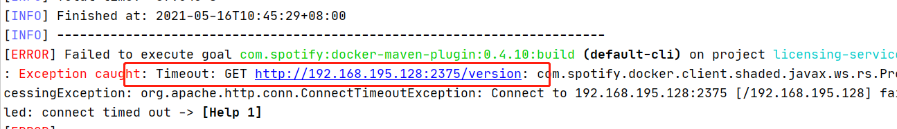
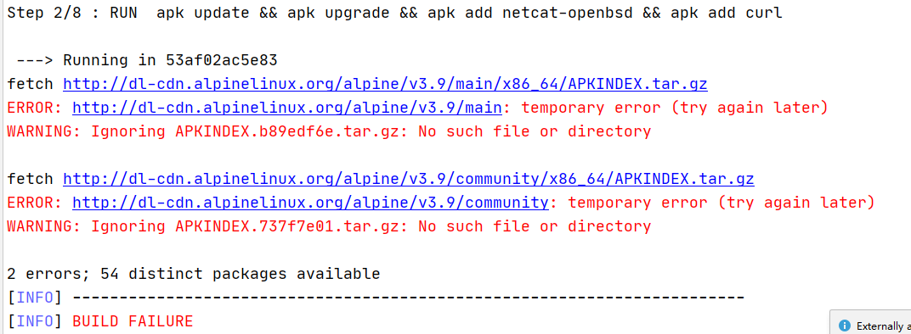

## Spring 微服务实战练习

本项目在本人学习SpringCloud微服务时创建，主要内容包括：
- SpringBoot 及搭建微服务部署环境
    - maven管理项目，并通过插件构建docker镜像
    - docker compose 编排容器
- Spring Cloud Config 配置管理
    - 本地管理
    - Git管理
- Eureka 服务发现
    - Spring Discovery Client 查找服务
    - RestTemplate with Ribbon
    - Netflix Feign
- Hystrix 客户端弹性模式
    - 断路器模式
    - 后备模式
    - 舱壁模式
    - Hystrix 并发策略自定义
- Zuul 服务网关
    - 路由
    - 过滤器
- OAuth2 认证服务 （微服务安全）
- Spring Cloud Stream 事件驱动
- Spring Cloud Sleuth & Zipkin 分布式跟踪

以上功能都以git分支区分，每一个目录一个分支。

> 参考书籍《Spring Microservices IN ACTION》


### 准备
- java环境：jdk8  
- 本项目中的所有微服务都通过maven管理，并通过docker容器部署微服务
    - maven 环境：
        - apache-maven-3.6.3
    - docker 环境
        - 本地 Windows Docker 环境注意：
          需要暴露出本地docker 的守护进程，在setings - General 中勾选：Expose daemon on tcp://localhost:2375 without TLS 选项。 
        - 远程Docker环境
          - 添加系统环境变量：
            DOCKER_HOST=tcp://192.168.195.128:2375
          - 远程机器开放2375/tcp端口，或关闭防火墙
          - 开启远程docker守护进程远程调用：
            ```shell script
            # 修改配置
            vim /lib/systemd/system/docker.service
            # 修改ExecStart一行，其中添加：-H tcp://0.0.0.0:2375
            # ExecStart=/usr/bin/dockerd -H tcp://0.0.0.0:2375 -H fd:// --containerd=/run/containerd/containerd.sock
            
            # 重启Docker服务
            systemctl daemon-reload
            systemctl restart docker
            
            # 测试
            curl http://localhost:22375/version
            # 本地浏览器访问 http://{远程主机IP地址}:22375/version
            ```
        - docker国内镜像配置：
          因为需要从共有镜像库拉取相关镜像，最好配置一个国内镜像地址，提高下载速度。 
          > Linux中，在/etc/docker/daemon.json配置

### 编译项目（以 v1.0-simple-service 为例）
- 编译整个项目需要在根目录下执行：
    ```shell script
    mvn clean package docker:build
    ```
    > 如果只想编译单个服务的镜像，需要到指定model的根目录执行

### 启动服务（以 v1.0-simple-service 为例）
> 所有指令都要在docker环境中执行

- 通过docker run 启动simple-service
    ```shell script
    docker run -p8080:8080 -d adminhubo/cloud-simple-service:chapter1
    ```
  simple-service测试接口:/hello/{firstName}/{lastName}  
  在浏览器访问：http://{docker容器宿主机}:8080/hello/firstName/lastName

- 通过 Docker Compose 启动服务
    - 需要安装，[参考Docker官网](https://docs.docker.com/compose/install/#install-compose)
    - 上传启动文件到docker容器宿主机
        - Windows本地docker环境不需要上传,镜像构建完成后直接在项目根目录下执行命令即可。
        
        - 远程环境  
          将项目根目录中的docker文件夹上传到docker宿主机
    - 执行命令启动微服务：
        ```shell script
        docker-compose -f docker/common/docker-compose.yml up
        
        # 后台运行加-d
        # docker-compose -f docker/common/docker-compose.yml up -d
        
        # 产看单个服务的启动日志
        # docker logs {容器标识}
        ```

## For the branch of v2.0-spring-cloud-config
#### 新曾模块说明
- config server 服务端
    - configuration-service-git  
      以Git仓库作为存储配置文件的配置中心服务
    - configuration-service-localfile  
      以本地文件系统作为存储配置文件的配置中心服务
- config client 客户端
    - licensing-servic  
      一个证书管理服务，将配置文件交给 config server 管理

#### 注意事项
- 项目以docker容器编排启动
    1. 通过maven编译docker镜像  
       项目根目录下执行：
       ```shell script
       mvn clean package docker:build
       ```
       我之前编译上一个版本simple-service时正常，但是这次编译时出现了一些错误：  
       1. 连接不到远程docker
            
          原因：之前docker宿主机重启了，防火墙没有关闭
          解决：关闭防火墙或者开放tcp/2375端口
       2. 镜像构建时无法下载相关文件
            
          原因：可能时由于之前docker宿主机强制关机，百度有人说是镜像源处理问题
          解决：我重启docker之后就好了
          
    2. 在容器宿主机上传根目录下单docker文件夹，然后执行命令：
       ```shell script
       docker-compose -f docker/common/docker-compose-chapter2-localfile.yml up -d
       ```
       或者：
       ```shell script
       docker-compose -f docker/common/docker-compose-chapter2-git.yml up -d
       ```
- 在本地idea启动：
1. 下载并安装加密所需要的Oracle JCE jar  
    > jce_policy-8:项目根目录下z_other_jar中提供了相关的jar
    
    将z_other_jar\jce_policy-8\UnlimitedJCEPolicyJDK8中的jar包拷贝到自己%JAVA_HOME%/jre/lib/security下
2. 添加密钥环境变量：
    ENCRYPT_KEY=IMSYMMENTRIC
2. 需要修改配置文件中的数据库连接  
   - 直接修改 config server 服务中licensing-service的配置文件： 
     文件路径：src\main\resources\config\licensingservice\licensingservice.yml：
     修改内容：
       ```text
       spring.datasource.url: "jdbc:postgresql://database:5432/eagle_eye_local" 
       spring.datasource.username: "postgres"
       spring.datasource.password: "{cipher}e3c0ee309724744fd660f83c851bee545558749369d68d30ea91ce9aee5ccc07"
       改为
       spring.datasource.url: "jdbc:postgresql://{自己的postgresql数据库地址}:{端口}/{数据库名称}"
       spring.datasource.username: "{数据库用户名}"
       spring.datasource.password: "{cipher}加密后的密码"
       ```
   - 为系统添加域名主机名映射  
     添加 database 主机名 到 数据库实际地址的映射：  
     例如：在C:\Windows\System32\drivers\etc\host中添加
     ```text
      127.0.0.1 database
     ```
     > 前面时数据库的实际地址，后面时映射的主机名。这样一来，licensing-service从config server读取的配置文件中jdbc:postgresql://database:5432/eagle_eye_local就可以直接映射到指定的数据库服务
   
## For the branch of v3.0-spring-cloud-eureka
#### 新曾模块说明
- eureka server 服务端
    - eurekasvr  
      注册中心服务端，客户端向服务端注册
      
- eureka client 客户端
    - organization-service  
      新增的服务：一个管理组织结构的服务。
      - 使用配置中心获取配置文件
      - 向注册中心注册服务
    - licensing-servic  
      修改证书服务：
      - 向注册中心注册服务
      - 添加三种方式远程调用organization-service

#### 注意事项
- 项目启动方式：类似上一节  
  容器编排文件：  
  docker\common\docker-compose-chapter3-localfile.yml

- licensing-service服务新增的三个访问方式在：  
  licensing-service\src\main\java\com\thoughtmechanix\licenses\clients
  
  测试端点：
  - v1/tools/eureka/services  
    获取注册中心已注册的服务  
  - v1/organizations/{organizationId}/licenses/{licenseId}/{clientType}  
    获取证书信息及远程调用获取组织机构详细信息
    - clientType：feign,rest,discovery

## For the branch of v4.0-spring-cloud-hystrix
#### 新曾模块说明
- 无新增模块

#### 新增功能
- 在两个微服务中增加熔断功能
- 自定义熔断器线程管理策略，传递上下文

测试端点：
   >  /v1/organizations/e254f8c-c442-4ebe-a82a-e2fc1d1ff78a/licenses/
   
   > /v1/organizations/e254f8c-c442-4ebe-a82a-e2fc1d1ff78a/licenses/f3831f8c-c338-4ebe-a82a-e2fc1d1ff78a

#### 注意事项
- 测试熔断功能时：有1/3的概率出发熔断
- 测试自定义线程管理策略时  
  需要在请求头中添加请求头：tmx-correlation-id，然后在日志中可以看到这个头信息的传递
  > 这里的上下问传递是在同一个服务中主线程和熔断器线程组中的线程之间，
  > 该传递过程不会跨服务，licensing-service远程调用organization-service时，
  > organization-service 日志输出 null。跨服务的传递上下问需要借助网关
 
 ## For the branch of v5.0-spring-cloud-zuul
#### 新增模块说明
 - specialroutes-service  
   特殊路由管理服务，可以通过服务ID查询可替代的新服务
 - orgservice-new  
   新版的组织机构服务
 - zuulsvr  
   网关服务，实现路由功能，链路跟踪（关联ID传递向下游服务传递），路由过滤器（pre，post，route）实例
 
 #### 特殊说明
在Zuul服务做路由转发过滤时，我按照书中的凡是没有实现。  
> 遇到的问题：路由转发后从新服务获取到响应，但是后续又路由到了老版服务获取了旧数据。

> 解决：修改自定义的路由过滤器，利用Zuul提共的RibbonRoutingFilter通过ribbon和服务ID向新服务转发请求，
> 我在这里想的方式是，在RibbonRoutingFilter之前加一个路由过滤器，在准发前修改服务id，将指向老服务的id换成新的。

注:书中的方案时没有问题的，因为在官网也有类似的例子，但是我一直没有调通，主要原因还是对Zuul的了解不深入，做完这个学习项目之后再专门看一下Zuul。

## For the branch of v6.0-spring-cloud-oauth2
#### 新增模块说明
- authentication-service  
  OAuth2认证服务

#### 测试端点
- /auth/oauth/token    
  获取令牌端点:
  - 参数:    
    在postman中Body中填写一下参数
    - grant_type  
      认证类型,选择password
    - scope  
      令牌作用域:webclient,mobileclient
    - username 和 password
      william.woodward 的密码 password2   
      john.carnell 的密码是 password1
  - 认证应用:
    - 应用名:eagleeye ,密码:thisissecret  
        在postman中测试接口时在Authoritarian中选择Basic Auth,填写这两个信息.
  
- /auth/user  
  通过令牌到认证服务验证并获取用户信息
  - 添加请求头
    ```text
    Authorization = Bearer {令牌access_token}
    ```  
    
## For the branch of v6.1-spring-cloud-oauth2-jwt
#### 新增模块说明
- 使用JWT令牌

#### 测试端点
```shell script
# 添加请求头
Authorization = Bearer {令牌access_token}
# 请求端点
127.0.0.1:5555/api/licensing/v1/organizations/e254f8c-c442-4ebe-a82a-e2fc1d1ff78a/licenses/f3831f8c-c338-4ebe-a82a-e2fc1d1ff78a
```  

## For the branch of v7.0-spring-cloud-stream-kafka
#### 新增
- 组织服务增加发送消息功能（消息生产者）
- 证书服务增加接收消息功能（消息订阅者）
- 本地测试需要按照kafka（消息管理）
- 使用kafka需要zookeeper环境

#### 内容描述
> 简单的使用 Spring Stream 实现服务之间消息的传递功能。

## For the branch of v7.1-spring-cloud-stream-kafka-redis
#### 新增功能点
- redis服务环境（项目启动依赖）
- 分布式缓存组织数据的简单缓存和获取
- 自定义消息通道
- 通过消息操作分布式缓存

## For the branch of v8.0-spring-cloud-sleuth-logspout-papertrail
#### 内容描述
> 利用 sleuth 事项分布式事务跟踪管理，logspout 将sleuth形式的日志发送到papertrail日志统一管理平台，完成分布式日志的聚合。

#### 添加内容
- 在组织服务、证书服务、认证服务和网关服务中引入sleuth依赖
- 修改网关服务后置过滤器，使用sleuth的跟踪id作为关联id传递

## For the branch of v8.1-spring-cloud-sleuth-zipkin
#### 内容描述
> zipkin跟踪事件，监测分析性能

#### 添加内容
- zipkinsvr 事件跟踪服务
- 自定义事件跨度